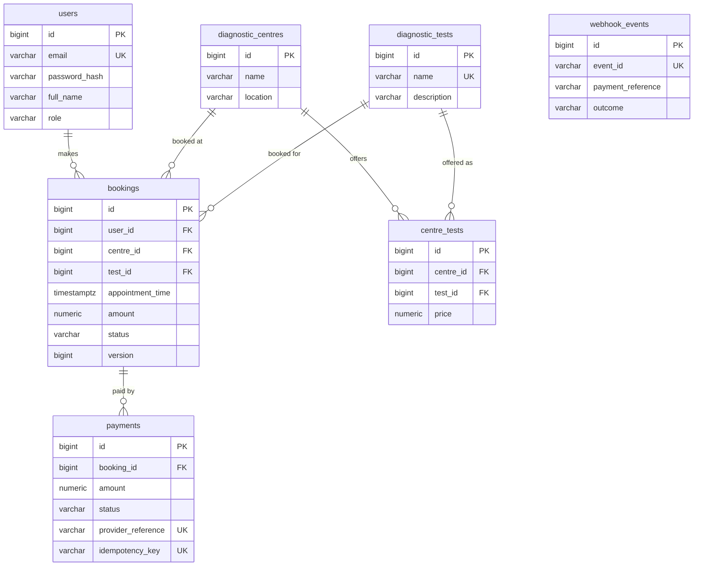
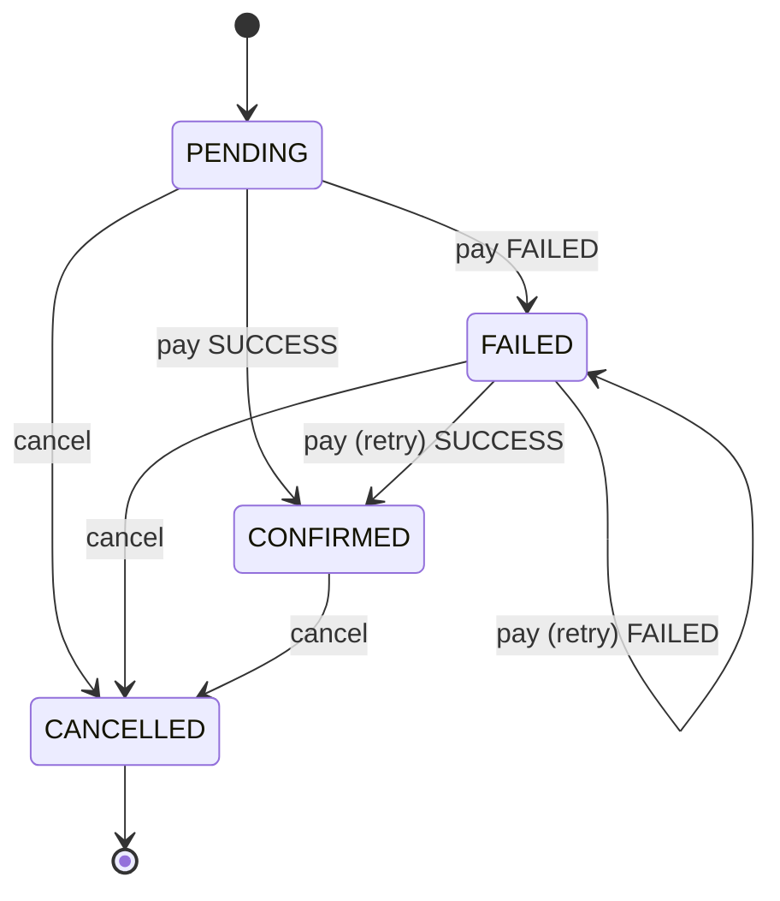

<div align="center">

# 🩺 EVE Diagnostics

**Booking & simulated payments backend with an idempotent, HMAC-signed payment webhook**

**Java 21** · **Spring Boot 3.4** · **PostgreSQL 16** · **Flyway** · **Docker** · **Swagger UI** · **JUnit 5 + MockMvc**

[Quick start](#-quick-start) · [API](#-api-overview) · [Webhook](#-webhook-contract) · [Design](#-design) · [Assumptions](#-assumptions) · [Roadmap](#-roadmap)

</div>

---

A Spring Boot REST backend for booking diagnostic tests, with a mock payment service and a webhook that is safe to replay, race, and retry.

## ✨ Highlights

- 🔐 **JWT auth** with `USER` / `ADMIN` roles, BCrypt hashing, per-IP rate limiting on login/signup
- 💳 **Simulated payments** with retryable failures and optional `Idempotency-Key` support
- 🔁 **Idempotent webhook**: HMAC-SHA256 signature, unique `event_id`, row-level locking, deterministic transition rules
- 🛡️ **Integrity in the database too**: CHECK constraints, FKs, and a partial unique index so a booking can never have two successful payments
- 🧾 **Price snapshots** on bookings; money is always `NUMERIC(12,2)` / `BigDecimal`
- 📖 **Swagger UI**, Flyway migrations, ECS-format JSON logs, request IDs, pagination
- 🧪 **Integration tests** that need no database (H2 in PostgreSQL mode)
- 🖥️ **Bundled demo UI** with a webhook simulator

## 🚀 Quick start

### Option A: Docker (only Docker required)

```bash
docker compose up --build
```

| What | URL |
|---|---|
| API | <http://localhost:8080> |
| Documentation | <http://localhost:8080/docs.html> |
| Demo UI | <http://localhost:8080/> |
| Health | <http://localhost:8080/actuator/health> |

> [!NOTE]
> In Docker mode, logs are structured JSON (ECS format).

### Option B: Local (JDK 21 + Maven 3.9+)

```bash
docker compose up -d db   # PostgreSQL on localhost:5432 (db/user/password: eve_diagnostics / eve / eve)
mvn spring-boot:run
```

Any PostgreSQL works. Override `DB_URL`, `DB_USERNAME`, `DB_PASSWORD`.

### Run the tests

```bash
mvn test
```

Integration tests (`@SpringBootTest` + MockMvc) run against in-memory H2 in PostgreSQL mode, so no database is needed.

### Seed data & accounts

On first start the app creates:

| What | Value |
|---|---|
| Admin account | `admin@eve.local` / `Admin@12345` (override with `APP_ADMIN_EMAIL`, `APP_ADMIN_PASSWORD`) |
| Sample catalogue | 5 tests and 3 centres (Hyderabad, Bengaluru, Mumbai) with prices. Disable with `APP_SEED_SAMPLE_DATA=false` |

Regular users register through `POST /auth/signup`.

> [!WARNING]
> The default admin password, JWT secret, webhook secret and CORS `*` are **for development only**. Change them in any real deployment.

<details>
<summary><b>⚙️ Configuration (environment variables)</b></summary>

<br>

| Variable | Default (dev only!) | Purpose |
|---|---|---|
| `DB_URL`, `DB_USERNAME`, `DB_PASSWORD` | local Postgres | Database |
| `APP_JWT_SECRET` | dev value | HMAC key for JWTs, **≥ 32 bytes** (app refuses to start otherwise) |
| `APP_JWT_EXPIRATION_MINUTES` | `60` | Token lifetime |
| `APP_WEBHOOK_SECRET` | `dev-webhook-secret` | Shared secret for webhook signatures |
| `APP_WEBHOOK_SIGNATURE_REQUIRED` | `true` | Set `false` to call the webhook unsigned while experimenting |
| `APP_PAYMENT_SUCCESS_RATE` | `0.8` | Success probability of the mock payment when no outcome is forced |
| `APP_CORS_ALLOWED_ORIGINS` | `*` | Allowed browser origins (comma-separated patterns) |
| `APP_RATE_LIMIT_ENABLED`, `APP_RATE_LIMIT_AUTH_PER_MINUTE` | `true`, `20` | Login/signup rate limit per IP |
| `APP_ADMIN_EMAIL`, `APP_ADMIN_PASSWORD` | see above | Bootstrap admin |
| `APP_SEED_SAMPLE_DATA` | `true` | Seed the sample catalogue |

</details>

## 🖥️ Demo UI

A single-page demo lives at `src/main/resources/static/index.html` and is served by the app. Start the backend and open <http://localhost:8080/>.

It walks through: **sign up / log in → browse centres → create a booking → pay (force success, force failure, or random) → cancel**.

It also includes a **webhook simulator** that signs events with HMAC-SHA256. Send an event, then send the same event ID again and watch it return `DUPLICATE`. Every request and response appears in the API log panel.

The file can also be opened standalone; set the API URL in the header. CORS is enabled for local demos via `app.cors.allowed-origins` (default `*`; restrict it in real deployments).

## 📡 API overview

Interactive docs: **Swagger UI** at `/swagger-ui.html` (click *Authorize* and paste the JWT). OpenAPI JSON at `/v3/api-docs`.

| Method & path | Auth | Description |
|---|---|---|
| `POST /auth/signup` | public | Register (role `USER`) → `201` |
| `POST /auth/login` | public | Returns `{accessToken, tokenType, expiresInSeconds}` |
| `GET /auth/me` | user | Current user |
| `GET /tests`, `GET /tests/{id}` | public | List (`q`, `page`, `size`) / get diagnostic tests |
| `POST /tests`, `PUT /tests/{id}` | **admin** | Create / update a test |
| `GET /centres`, `GET /centres/{id}` | public | List (`location`, `testId`, `page`, `size`) / get a centre with its tests and prices |
| `POST /centres`, `PUT /centres/{id}` | **admin** | Create / update a centre |
| `PUT /centres/{centreId}/tests/{testId}` | **admin** | Offer a test at a centre / change its price: `{"price": 1200.00}` |
| `DELETE /centres/{centreId}/tests/{testId}` | **admin** | Stop offering a test |
| `POST /bookings` | user | Create booking (status `PENDING`) |
| `GET /bookings`, `GET /bookings/{id}` | user | **Own** bookings only (`status`, `page`, `size`) |
| `POST /bookings/{id}/cancel` | user | Cancel own booking |
| `POST /payments/` | user | Simulated payment for a booking; updates the booking |
| `GET /payments/{id}` | user | Own payment |
| `POST /payments/webhook/` | HMAC signature | Provider payment-status event (idempotent) |

Trailing slashes are accepted on collection/POST routes, so `/payments/` and `/payments/webhook/` work exactly as specified in the assignment.

All errors share one shape:

```json
{
  "timestamp": "2026-10-02T10:00:00Z",
  "status": 400,
  "error": "Bad Request",
  "message": "Validation failed",
  "path": "/auth/signup",
  "details": [
    { "field": "password", "message": "must contain at least one letter and one digit" }
  ]
}
```

### Example session

```bash
BASE=http://localhost:8080

# 1. Sign up + log in
curl -s -X POST $BASE/auth/signup -H 'Content-Type: application/json' \
  -d '{"email":"jane@example.com","password":"Passw0rd!","fullName":"Jane Doe"}'
TOKEN=$(curl -s -X POST $BASE/auth/login -H 'Content-Type: application/json' \
  -d '{"email":"jane@example.com","password":"Passw0rd!"}' \
  | python3 -c 'import sys,json;print(json.load(sys.stdin)["accessToken"])')

# 2. Browse centres (public); note a centreId and testId
curl -s "$BASE/centres?location=hyderabad"

# 3. Book (appointmentTime must be in the future, ISO-8601)
curl -s -X POST $BASE/bookings -H "Authorization: Bearer $TOKEN" -H 'Content-Type: application/json' \
  -d '{"centreId":1,"testId":1,"appointmentTime":"2027-01-15T10:30:00Z"}'
# -> {"id":1,"status":"PENDING","amount":350.00,...}

# 4. Pay. Omit simulatedOutcome for a random result, or force SUCCESS / FAILED.
curl -s -X POST $BASE/payments/ -H "Authorization: Bearer $TOKEN" -H 'Content-Type: application/json' \
  -H 'Idempotency-Key: order-1-attempt-1' \
  -d '{"bookingId":1,"simulatedOutcome":"FAILED"}'
# -> 201 {"id":1,"status":"FAILED","providerReference":"pay_ab12...","bookingStatus":"FAILED",...}

# 5. Provider webhook (signed). Replaying the same eventId is harmless.
./scripts/send-webhook.sh evt_001 pay_ab12... SUCCESS   # -> {"result":"PROCESSED",...}
./scripts/send-webhook.sh evt_001 pay_ab12... SUCCESS   # -> {"result":"DUPLICATE",...}
curl -s $BASE/bookings/1 -H "Authorization: Bearer $TOKEN"   # status: CONFIRMED
```

## 🔔 Webhook contract

`POST /payments/webhook/`

```json
{ "eventId": "evt_001", "paymentReference": "pay_ab12...", "status": "SUCCESS" }
```

**Signature header:** `X-Webhook-Signature` = hex `HMAC-SHA256(rawBody, APP_WEBHOOK_SECRET)` (an optional `sha256=` prefix is accepted). Missing or invalid → **401**. `scripts/send-webhook.sh` builds a correctly signed request (needs `openssl` + `curl`).

**Response:** `200 {"eventId","result","message"}` where `result` is one of:

| `result` | Meaning |
|---|---|
| `PROCESSED` | State changed (payment `FAILED → SUCCESS`, booking → `CONFIRMED`) |
| `NO_CHANGE` | A *new* event, but the payment is already in that state |
| `IGNORED` | New event that must not be applied ([rules below](#transition-rules-for-a-new-event)) |
| `DUPLICATE` | This `eventId` was already received; nothing was touched |

**Other responses:**

| Status | When |
|---|---|
| `400` | Invalid payload |
| `401` | Bad or missing signature |
| `404` | Unknown `paymentReference`. The event is **not** recorded, so the provider's retry can succeed once the payment exists |

## 🏗️ Design

### Project layout

```
web/         controllers + GlobalExceptionHandler (one error format)
service/     business rules & transactions (Auth, Catalog, Booking, Payment, Webhook[Service|Processor])
repository/  Spring Data JPA repositories
domain/      JPA entities + enums
dto/         request/response records with Bean Validation
security/    JWT service/filter, JSON 401/403 handlers
config/      security, OpenAPI, rate limiting, request-id logging, bootstrap data
```

### Database schema

Managed by Flyway: [`V1__init_schema.sql`](src/main/resources/db/migration/V1__init_schema.sql).



**Key decisions**

- **`centre_tests`** is the join table "centre offers test at price". The price belongs to the *offering*, so the same test can cost different amounts at different centres. `UNIQUE(centre_id, test_id)`.
- **`bookings.amount` is a price snapshot** taken at booking time; later price edits never change an existing booking.
- **One booking, many payments**: a failed payment can be retried, so history is kept instead of overwritten.
- **Integrity is enforced in the database as well as in code**: `CHECK` constraints on statuses/prices, FKs, case-insensitive unique indexes on test names and centre (name, location), and a partial unique index `uq_payments_one_success_per_booking (booking_id) WHERE status='SUCCESS'`. A booking can *never* have two successful payments, even if application logic had a bug.
- **`webhook_events.event_id` is `UNIQUE`**: the foundation of webhook idempotency.
- Timestamps are `TIMESTAMPTZ` (UTC). `bookings` has an `@Version` column as an additional optimistic-lock safety net.

### Booking state machine



`CANCELLED` is terminal, and a `CONFIRMED` booking cannot be paid again.

### Idempotency & concurrency

#### Webhook (`WebhookService` → `WebhookProcessor`)

1. Authenticate (HMAC, constant-time compare) and validate the payload.
2. In **one transaction**: if `event_id` already exists, return `DUPLICATE`. Otherwise **insert the event row first**, then lock the booking (`SELECT ... FOR UPDATE`), apply the state transition and record the outcome.
3. If two deliveries of the same event race, both try to insert the same `event_id`. One wins; the other blocks on the unique index and fails with a constraint violation, which `WebhookService` converts into a normal `DUPLICATE` response. No duplicate payments, bookings or events can result.
4. Any failure (e.g. unknown payment) rolls the whole transaction back, including the event row, so provider retries are never "poisoned".

#### Transition rules for a new event

All deliberate, to protect money and state:

| Condition | Result |
|---|---|
| Payment already in the reported status | `NO_CHANGE` |
| Payment is `SUCCESS` and event says `FAILED` | `IGNORED` (success is final; refunds would be a separate event type) |
| Booking is `CANCELLED` | `IGNORED` |
| Booking already has another successful payment | `IGNORED` (prevents double charging via a late event for an old failed attempt) |
| Otherwise (`FAILED → SUCCESS`) | `PROCESSED`: payment `SUCCESS`, booking `CONFIRMED` |

#### Payments (`PaymentService`)

Payments lock the booking row before deciding anything, so concurrent pay / cancel / webhook operations for one booking are serialised. An optional `Idempotency-Key` header makes client retries of `POST /payments/` safe: a replay returns the original payment with `200` instead of `201`.

### Security

- Passwords hashed with **BCrypt**; **JWT (HS256)** carries user id, email and role; stateless sessions; CSRF disabled (no cookies/sessions).
- Roles: `USER` and `ADMIN`. Catalogue reads are public; catalogue writes are admin-only (`403` for users, `401` without a token).
- **Ownership:** users can only see/pay/cancel their own bookings and payments. Someone else's id returns `404` (not `403`) so ids can't be probed.
- Login returns the same message for unknown email and wrong password. Login/signup are rate limited per IP (in-memory).

<details>
<summary><b>🧯 Edge cases covered</b></summary>

<br>

| Case | Behaviour |
|---|---|
| Invalid/missing fields, bad JSON, bad enum, bad path id (`/bookings/abc`) | `400` with field-level `details` |
| Weak password / bad email / duplicate email | `400` / `400` / `409` |
| Missing, malformed, tampered or expired JWT | `401` |
| Non-admin modifies catalogue | `403` |
| Access to another user's booking/payment | `404` |
| Unknown booking / centre / test id | `404` |
| Test not offered by the chosen centre | `404` |
| Appointment time in the past | `400` |
| Same user, same test/centre/time already active | `409` |
| Paying a confirmed or cancelled booking | `409` (no second payment created) |
| Payment fails | Payment `FAILED`, booking `FAILED`, can be retried |
| Duplicate / replayed webhook (also concurrent) | `200 DUPLICATE`, no state change |
| Webhook: bad signature / bad payload / unknown payment | `401` / `400` / `404` |
| Out-of-order or contradictory webhooks | `NO_CHANGE` / `IGNORED` per the rules above |
| Huge `size` / negative `page` | Clamped (max 100 / min 0) |

</details>

### Bonus items included

Docker + docker-compose · Swagger/OpenAPI · integration tests · structured logging (ECS JSON in Docker + per-request `X-Request-Id`) · pagination · rate limiting · Flyway migrations.

> Redis and Celery-style background jobs were intentionally left out.

## 📝 Assumptions

- `POST /payments/` is **synchronous**: the mock provider decides `SUCCESS`/`FAILED` immediately and the booking is updated in the same request. The webhook models the provider's *asynchronous* confirmations (e.g. a late settlement of a payment that first failed). `simulatedOutcome` exists only so the mock can be driven deterministically in tests and demos.
- A declined payment returns `201` with `status: FAILED` in the body (the payment record was created); it is not an HTTP error.
- Webhooks are authenticated with a shared-secret HMAC, the common pattern for payment providers.
- Cancelling a `CONFIRMED` booking just changes its status; refunds are out of scope.
- All timestamps are UTC instants (ISO-8601, e.g. `2027-01-15T10:30:00Z`). Slot capacity/availability per centre is not modelled.
- Admins are bootstrapped from configuration; there is no endpoint to promote users.
- The rate limiter keys on the TCP remote address; behind a proxy it should use a trusted `X-Forwarded-For`.

## 🗺️ Roadmap

- [ ] **Real payment lifecycle**: `PENDING` payments, provider-driven transitions, refunds, reconciliation of bookings stuck in `PENDING`
- [ ] **Background work**: transactional outbox + worker for webhook retries / confirmation emails; scheduled expiry of unpaid bookings
- [ ] **Redis**: cache the read-heavy catalogue; distributed rate limiter
- [ ] **Availability**: time slots and capacity per centre, with a DB exclusion constraint against double-booking
- [ ] **Auth**: refresh tokens, token revocation, email verification, password reset, admin user-management API
- [ ] **Webhook hardening**: timestamp in the signed payload to prevent replay of old signed requests, secret rotation, per-provider event schemas
- [ ] **Testing**: run integration tests against real PostgreSQL via Testcontainers (partial indexes, true row-lock behaviour); add concurrency tests for racing webhooks/payments; unit tests for the transition rules
- [ ] **Ops**: metrics (Micrometer/Prometheus), tracing, Dependabot/CI pipeline, secrets from a vault
